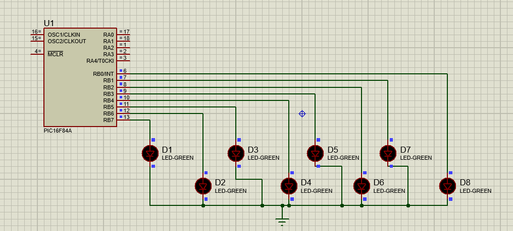
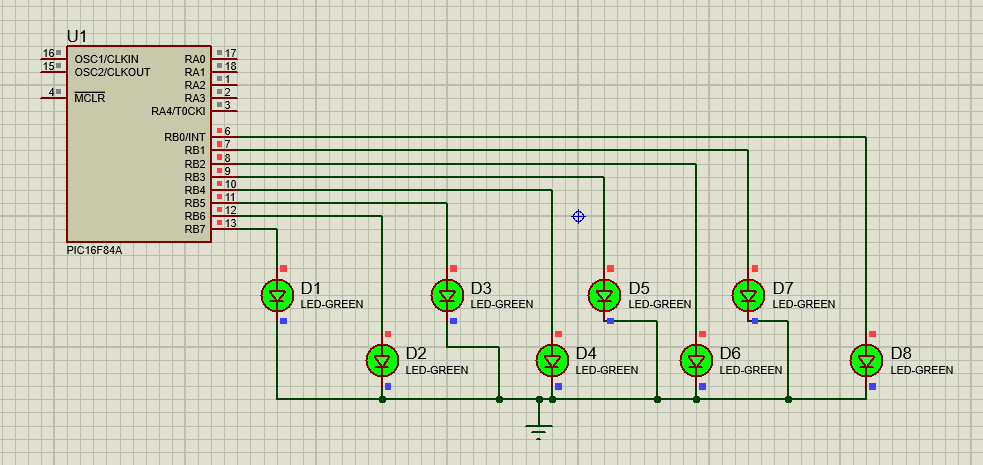

# LED Blinking using PIC16F84A

## Objective

Blink LEDs in ON/OFF pattern using PIC16F84A microcontroller.

## Components Used

* PIC16F84A
* LEDs

## Software Used

* MPLAB X IDE
* XC8 Compiler
* Proteus 8.17

## Files

* `led_blink.c` - Source Code
* `led_blink.hex` - Compiled HEX File
* `screenshot.png` - Simulation Output

## Output

The LEDs connected to PORTB continuously switch between ON and OFF states.

## Simulation Results

### LEDs OFF

### LEDs ON

