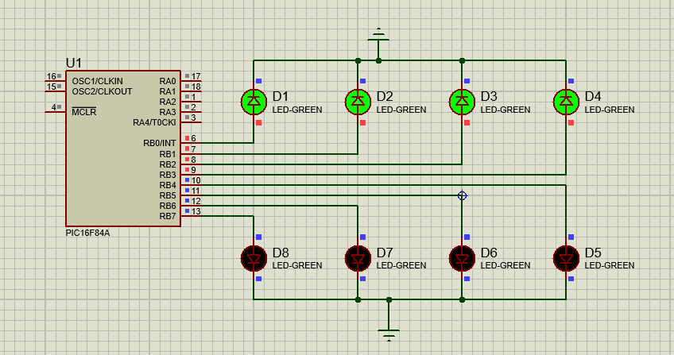

# Group LED Blinking using PIC16F84A

## Objective

To design and simulate a group LED blinking circuit using the PIC16F84A microcontroller.

## Description

This project demonstrates the control of 8 LEDs connected to PORTB of the PIC16F84A microcontroller. The LEDs are divided into two groups:

* Group 1: LED1, LED2, LED3, LED4
* Group 2: LED5, LED6, LED7, LED8

Initially, Group 1 is ON and Group 2 is OFF. After a short delay, Group 1 turns OFF and Group 2 turns ON. This sequence repeats continuously.

## Hardware Used

* PIC16F84A Microcontroller
* 8 LEDs

## Software Used

* MPLAB X IDE
* XC8 Compiler
* Proteus 8.17

## Files Included

* `group_led.c` – Embedded C source code
* `group_led.hex` – Compiled HEX file
* `Screenshots/` – Proteus simulation screenshots

## Working Principle

The PIC16F84A outputs binary patterns to PORTB.

* `0xF0` activates one group of LEDs.
* `0x0F` activates the other group of LEDs.

A software delay is used between pattern changes to make the blinking visible.

## Simulation Results

### Group 1 Active

### Group 2 Active

## Learning Outcomes

* Understanding PIC16F84A PORTB configuration
* Controlling multiple LEDs simultaneously
* Generating LED patterns using Embedded C
* Proteus simulation using HEX files

## Author

**Subodh Lakra**

M.Tech  
VLSI Design and Embedded Systems