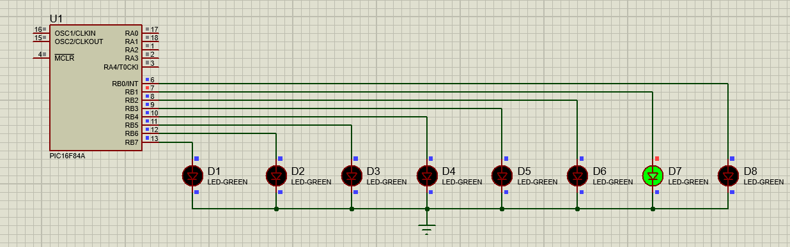

# Running LEDs using PIC16F84A

## Objective

To generate a running LED pattern using the PIC16F84A microcontroller.

## Description

This project demonstrates sequential control of 8 LEDs connected to PORTB. A single illuminated LED moves from left to right and then returns from right to left, creating a running light effect.

## Hardware Used

* PIC16F84A Microcontroller
* 8 LEDs

## Software Used

* MPLAB X IDE
* XC8 Compiler
* Proteus 8.17

## Files Included

* `running_leds.c`
* `running_leds.hex`
* `Screenshots/`

## Working Principle

The LED pattern is generated using bit shifting operations:

* Left Shift (`<<`) moves the illuminated LED from left to right.
* Right Shift (`>>`) moves the illuminated LED from right to left.

## Simulation Results

### Running LED Pattern

## Learning Outcomes

* Understanding bit shifting operations
* Sequential LED control
* Embedded C programming using PIC16F84A
* Proteus simulation

## Author

**Subodh Lakra**

M.Tech  
VLSI Design and Embedded Systems
