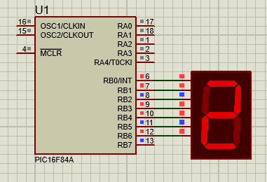
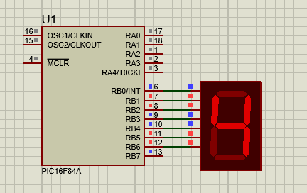
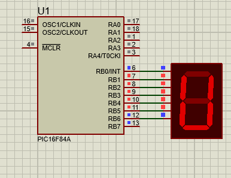
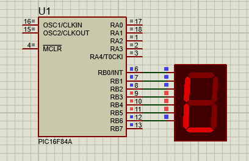
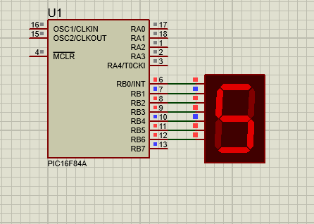
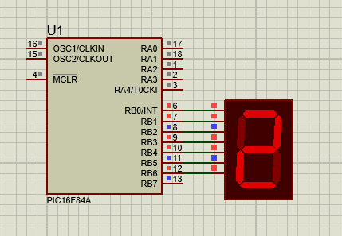
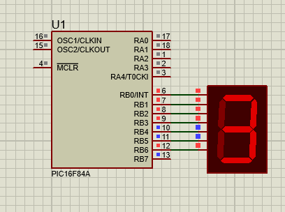

# Seven Segment Display using PIC16F84A

## Objective

To display the roll number **24VLS23** on a seven-segment display using the PIC16F84A microcontroller.

## Description

This project demonstrates interfacing a common cathode seven-segment display with the PIC16F84A microcontroller. Since some alphabetic characters cannot be represented perfectly on a seven-segment display, equivalent patterns are used where necessary.

The display sequence is:

24VLS23

where the character **V** is represented using the closest possible pattern available on a seven-segment display.

## Hardware Used

* PIC16F84A Microcontroller
* Seven Segment Display (Common Cathode)
* 5V Power Supply

## Software Used

* MPLAB X IDE
* XC8 Compiler
* Proteus 8.17

## Files Included

* `seven_segment_display.c`
* `seven_segment_display.hex`
* `seven_segment_display.pdsprj`
* `Screenshots/`

## Working Principle

The PIC16F84A sends predefined binary patterns to PORTB.

Each binary pattern corresponds to a specific digit or character on the seven-segment display.

The display sequence is:

```text
2 → 4 → V → L → S → 2 → 3
```

A software delay is used between character changes to make the sequence visible.

## Simulation Results

### Display 2



### Display 4



### Display V



### Display L



### Display S



### Display 2



### Display 3



## Learning Outcomes

* Interfacing seven-segment displays with PIC microcontrollers
* Understanding segment encoding
* Displaying alphanumeric characters
* Embedded C programming using PIC16F84A
* Proteus simulation and verification

## Author

**Subodh Lakra**

M.Tech
VLSI Design and Embedded Systems
