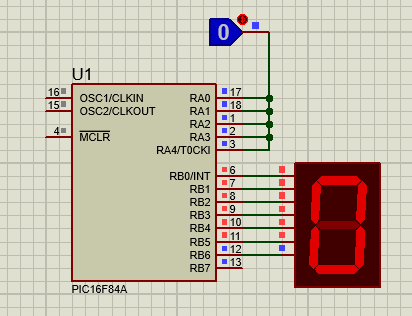
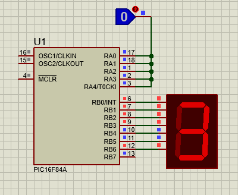
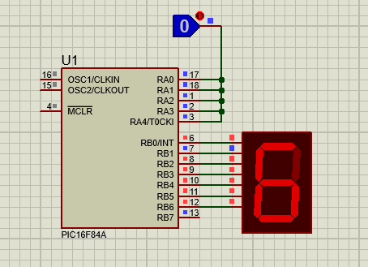
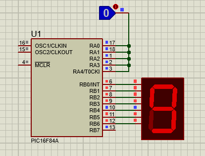
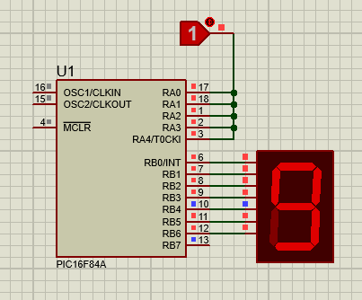
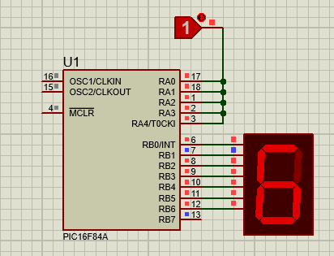
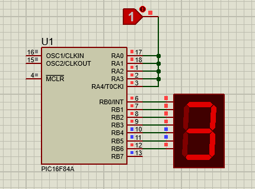
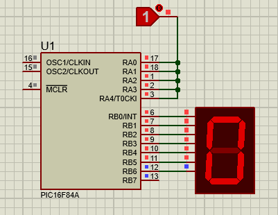

# Up/Down Counter using PIC16F84A

## Objective

To design and simulate an Up/Down Counter using the PIC16F84A microcontroller and a seven-segment display.

## Description

This project demonstrates the implementation of an Up/Down Counter using the PIC16F84A microcontroller. The counter displays numbers on a seven-segment display and can count in both ascending and descending order.

The counter operates in two modes:

* Up Counter: Counts from 0 to 9.
* Down Counter: Counts from 9 to 0.

A control input is used to select the counting direction.

## Hardware Used

* PIC16F84A Microcontroller
* Seven Segment Display
* Push Button / Switch

## Software Used

* MPLAB X IDE
* XC8 Compiler
* Proteus 8.17

## Files Included

* `up_down_counter.c`
* `up_down_counter.hex`
* `up_down_counter.pdsprj`
* `Screenshots/`

## Working Principle

The microcontroller continuously checks the control input.

* Logic HIGH selects Up Counting mode.
* Logic LOW selects Down Counting mode.

According to the selected mode, the corresponding digit patterns are sent to the seven-segment display.

## Simulation Results

### Up Counter

#### Count = 0

#### Count = 3

#### Count = 6

#### Count = 9

### Down Counter

#### Count = 9

#### Count = 6

#### Count = 3

#### Count = 0

## Learning Outcomes

* Interfacing seven-segment displays with PIC microcontrollers
* Implementing Up and Down counting logic
* Understanding digital inputs and outputs
* Embedded C programming using PIC16F84A
* Proteus simulation and verification

## Applications

* Digital Counters
* Event Counters
* Industrial Monitoring Systems
* Embedded Control Systems

## Author

**Subodh Lakra**

M.Tech
VLSI Design and Embedded Systems
