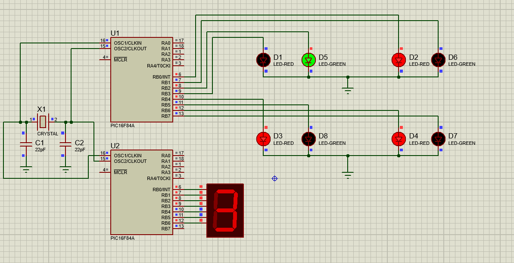
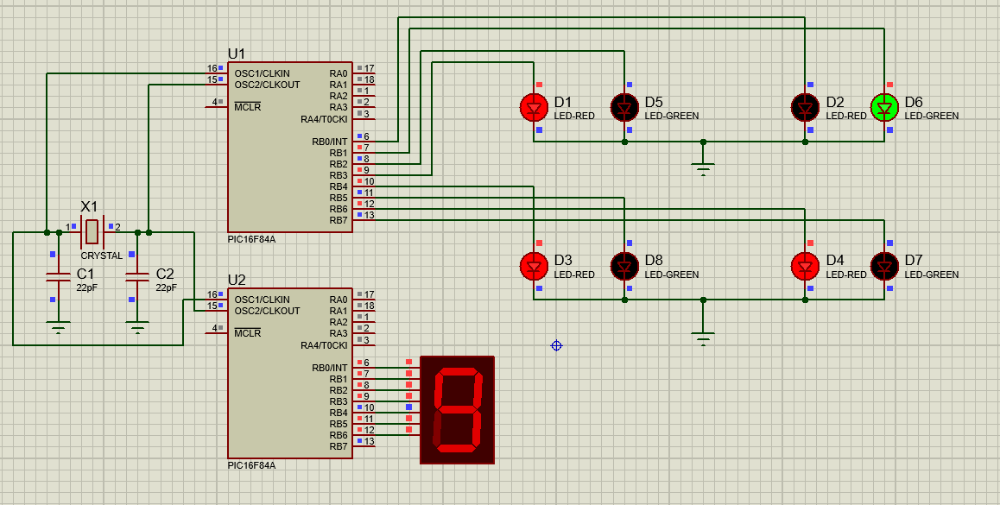
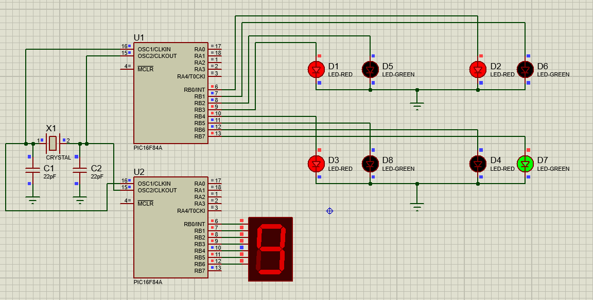
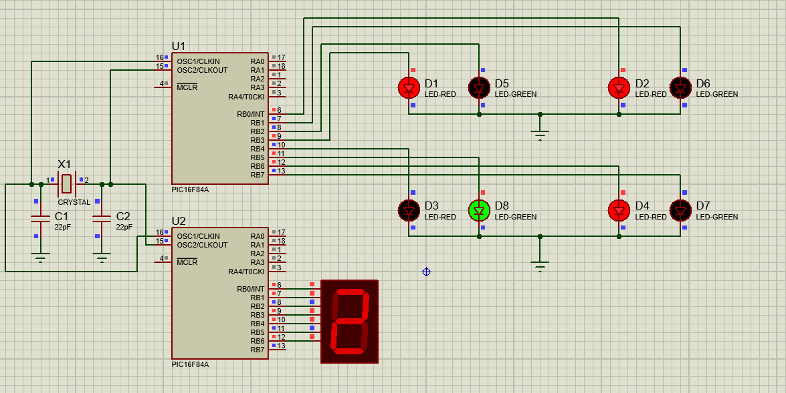

# Traffic Light Controller using PIC16F84A

## Objective

The objective of this project is to design and simulate a four-way traffic light controller using the PIC16F84A microcontroller. The system controls traffic flow by activating one green signal at a time while the remaining signals stay red. A countdown display is also implemented using a seven-segment display.

## Components Used

* PIC16F84A Microcontroller (2)
* 4 MHz Crystal Oscillator
* Capacitors
* LEDs (Red and Green)
* Seven-Segment Display
* Resistors
* Proteus Design Suite
* MPLAB X IDE
* XC8 Compiler

## Project Description

The traffic light controller operates in four different states. In each state, one traffic lane receives a green signal while the other lanes remain stopped. Every state remains active for approximately 10 seconds. A separate PIC16F84A controls the seven-segment display and performs a countdown from 9 to 0 during each traffic phase.

## Working Principle

1. The first traffic signal turns green for 10 seconds.
2. The countdown display decreases from 9 to 0.
3. The next traffic signal turns green for 10 seconds.
4. The process repeats continuously for all four traffic directions.

## Files Included

* traffic_light_controller.c
* traffic_light_controller.hex
* countdown_display.c
* countdown_display.hex
* traffic_light.pdsprj

## Simulation Results

### State 1 - D5 Green LED ON

### State 2 - D6 Green LED ON

### State 3 - D7 Green LED ON

### State 4 - D8 Green LED ON

## Software Used

* MPLAB X IDE
* XC8 Compiler
* Proteus Design Suite

## Author

Subodh Lakra
M.Tech
VLSI Design and Embedded Systems
