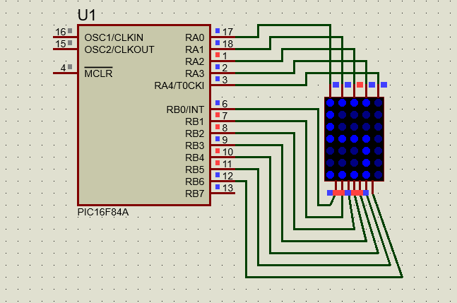
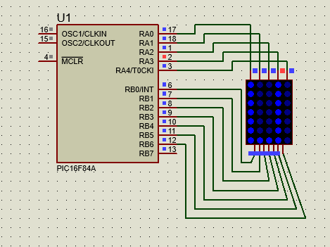
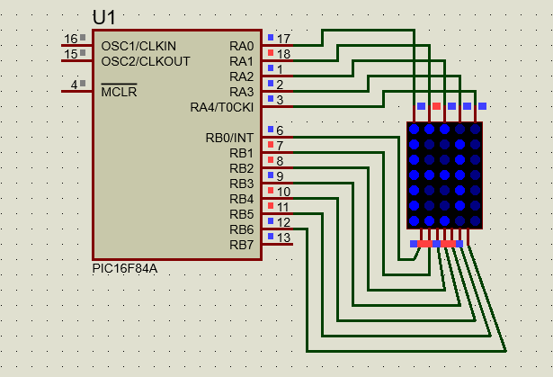
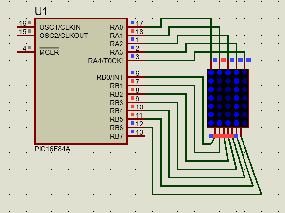
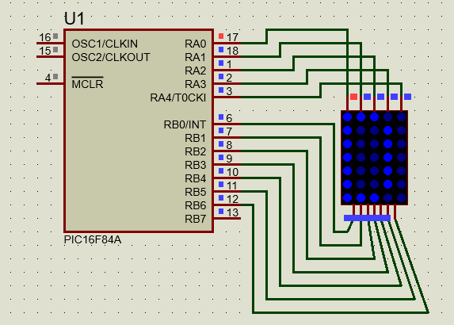
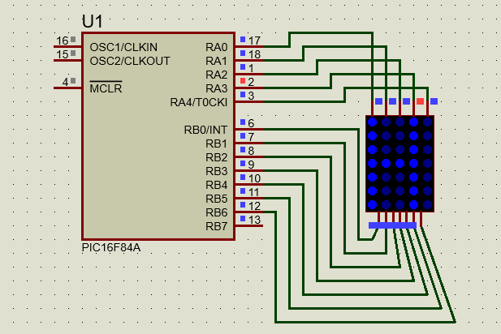

# LED Matrix Display using PIC Microcontroller

## Objective

The objective of this project is to display characters on a 5×7 LED matrix using a PIC microcontroller. The characters are generated by controlling rows and columns of the LED matrix according to predefined patterns.

## Components Used

* PIC Microcontroller
* 5×7 LED Matrix Display
* Crystal Oscillator
* Capacitors
* Resistors
* Proteus Design Suite
* MPLAB X IDE
* XC8 Compiler

## Project Description

This project demonstrates character generation on an LED matrix display. Character patterns are stored in a two-dimensional array and displayed sequentially through row-column scanning. The matrix displays the letters of the name "SUBODH" one at a time.

## Working Principle

1. Character patterns are stored in memory as binary values.
2. The microcontroller activates one column at a time.
3. Corresponding row data is sent to illuminate the required LEDs.
4. Rapid scanning creates the appearance of a complete character.
5. The characters S, U, B, O, D, and H are displayed sequentially.

## Files Included

* led_matrix_display.c
* led_matrix_display.hex
* led_matrix_display.pdsprj

## Simulation Results

### Letter S

### Letter U

### Letter B

### Letter O

### Letter D

### Letter H

## Software Used

* MPLAB X IDE
* XC8 Compiler
* Proteus Design Suite

## Applications

* Information Display Systems
* Digital Sign Boards
* Character Display Units
* Embedded System Learning Projects

## Author

Subodh Lakra
M.Tech
VLSI Design and Embedded Systems
