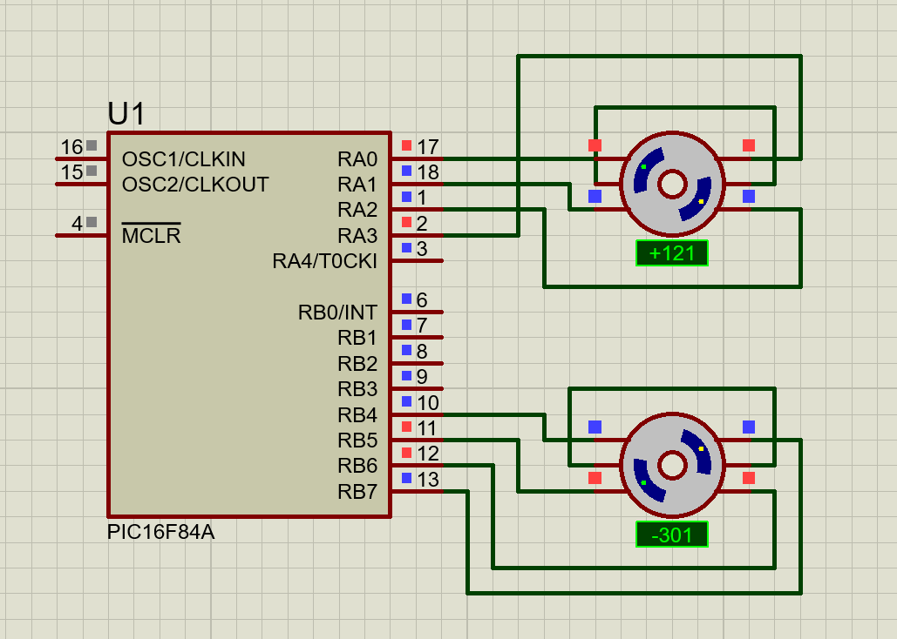
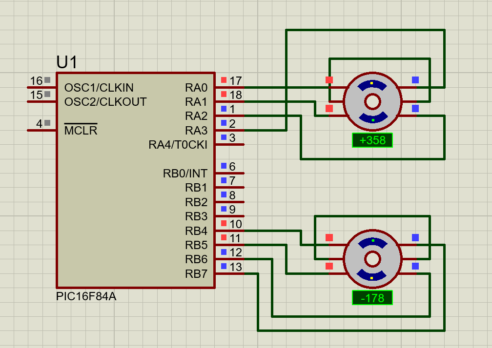

# Stepper Motor Control using PIC16F84A

## Objective

To control the rotation of a stepper motor using the PIC16F84A microcontroller. The motor can rotate in clockwise and anticlockwise directions by applying a sequence of excitation signals to the motor phases.

## Components Used

* PIC16F84A Microcontroller
* Stepper Motor (Proteus MOTOR-STEPPER)
* Proteus Simulation Software

## Working Principle

The stepper motor rotates when its phases are energized in a specific sequence. A sequence of binary patterns is sent from the microcontroller output pins to the motor phases. Reversing the sequence changes the direction of rotation.

### Clockwise Sequence

1100 → 0110 → 0011 → 1001

### Anticlockwise Sequence

1001 → 0011 → 0110 → 1100

## Program Description

The PIC16F84A generates the stepping sequence through its output pins. A delay is inserted between consecutive steps to control the motor speed. The motor direction can be selected through software logic.

## Simulation Results

The stepper motor successfully rotates in both clockwise and anticlockwise directions in Proteus simulation. Screenshots of the simulation are provided in the Screenshots folder.

## Files Included

* `stepper_motor_control.c` - Source Code
* `stepper_motor_control.hex` - Compiled HEX File
* `stepper_motor_control.pdsprj` - Proteus Simulation Project
* `Screenshots/` - Simulation Results

## Simulation Screenshots

### Clockwise Rotation

### Anticlockwise Rotation

## Proteus Simulation

Open `stepper_motor_control.pdsprj` in Proteus and load the provided HEX file to run the simulation.

## Learning Outcomes

* Understanding stepper motor operation
* Generating phase excitation sequences
* Interfacing motors with PIC microcontrollers
* Controlling motor direction and speed
* Proteus-based hardware simulation

## Author

Subodh Lakra
M.Tech (VLSI Desgin and Embedded Systems)
